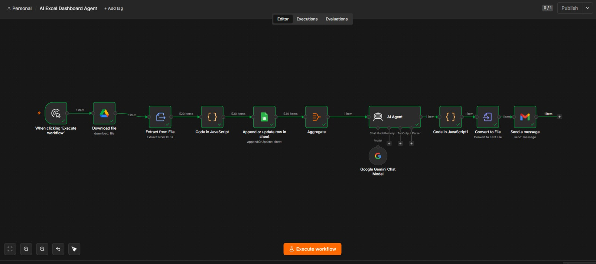

# 📊 AI-Powered Excel Analytics & Reporting Agent (n8n Workflow)




An automated end-to-end data processing and executive reporting pipeline built using **n8n**, **Google Drive**, **Google Sheets**, **Google Gemini AI**, and **Gmail**. 

This workflow automatically ingests raw sales datasets, cleans and standardizes messy data fields, stages the data into Google Sheets, runs an AI-powered data audit and KPI extraction using Google Gemini Flash, and dispatches a styled executive HTML summary via Gmail.

---

## 🚀 Workflow Architecture & Pipeline Flow

```text
[ Manual Trigger ]
       │
       ▼
[ Download File (Google Drive) ] ──► Ingests raw .xlsx dataset
       │
       ▼
[ Extract from File ] ──────────────► Parses rows into JSON objects
       │
       ▼
[ Code in JavaScript ] ─────────────► Sanitizes data (regex emails, numeric cleaning, return flags)
       │
       ▼
[ Google Sheets ] ──────────────────► Appends/updates cleaned records matched by OrderID
       │
       ▼
[ Aggregate ] ──────────────────────► Batches all rows into a single payload for the LLM
       │
       ▼
[ AI Agent (Gemini 3.6 Flash) ] ───► Audits data quality, extracts KPIs & recommendations
       │
       ▼
[ Code in JavaScript1 ] ────────────► Parses AI response & constructs responsive HTML template
       │
       ▼
[ Gmail (Send a message) ] ─────────► Dispatches styled HTML executive summary to stakeholders
